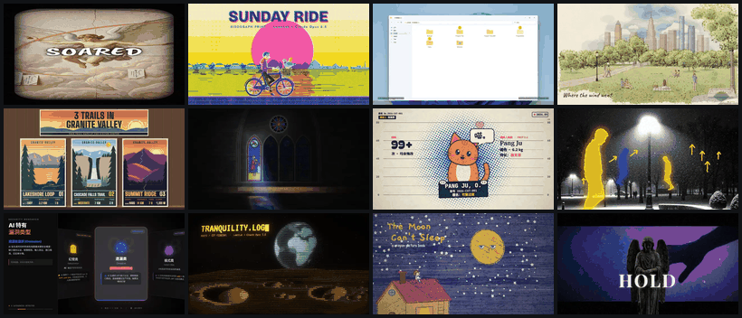
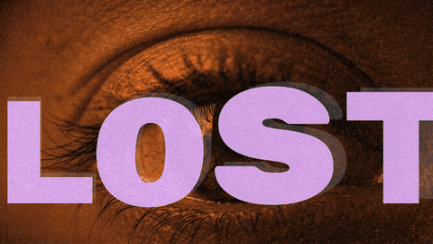
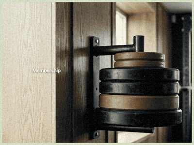
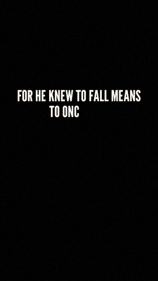
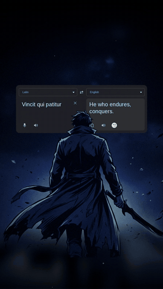

# Format Bin

A private gallery of 55 video formats you can reuse for your own videos: lyric videos, finance explainers, reels, carousels, painted and hand-drawn styles. Every format has a reference code, so you can say "make mine in `house:kinetic-lyric`" and get that look.

<p align="center"></p>

## A few of the formats

These clips come from videos made with the formats in the gallery.

<table>
  <tr>
    <td width="50%"><br><code>house:kinetic-lyric</code> giant-type lyric video</td>
    <td width="50%"><br><code>house:negative-collage</code> lyric collage with negative flips</td>
  </tr>
  <tr>
    <td><br><code>house:object-explainer</code> premium finance explainer</td>
    <td><br><code>house:anchor-lyric</code> statue-anchored lyric video</td>
  </tr>
</table>

<table>
  <tr>
    <td align="center" width="50%"><br><code>house:flicker-card</code> 9:16 story reel</td>
    <td align="center" width="50%"><br><code>house:latin-translate</code> 9:16 translation reel</td>
  </tr>
</table>

The other formats are Lemo-Opuscar film styles (`lemo:<slug>`, such as oil painting, watercolour, ink wash and ukiyo-e) and animation skills (`ai:<skill>`, such as flowcharts, phone UI demos and data cards).

## Get access

Live site: https://format-bin-videos.vercel.app

**Want to see all 55 formats?** The gallery is password-protected. Message me on [WhatsApp](https://wa.me/919619141433) or [Instagram](https://instagram.com/_.bhavya._015) for the password.


## How it works

- `middleware.js` runs on Vercel before every request. Visitors without a valid access cookie go to `login.html`.
- The password is not stored in the repo. `middleware.js` holds only two SHA-256 hashes of it, so the public code does not reveal it.
- A correct password sets an HttpOnly cookie for 30 days. Visit `/api/logout` to sign out.
- To change the password, recompute both hashes and replace `CRED_HASH` and `COOKIE_HASH`:

```sh
python3 -c 'import hashlib,sys; h=lambda s: hashlib.sha256(s.encode()).hexdigest(); p=sys.argv[1]; print(h("format-bin-cred:"+p)); print(h(h("format-bin-cookie:"+p)))' 'NEW_PASSWORD'
```

## Editing the gallery

`template.html` is the source; `build_gallery.py` inlines `lemo.json` into `index.html`. Thumbnails live in `thumbs/`, source images in `raw/`.
