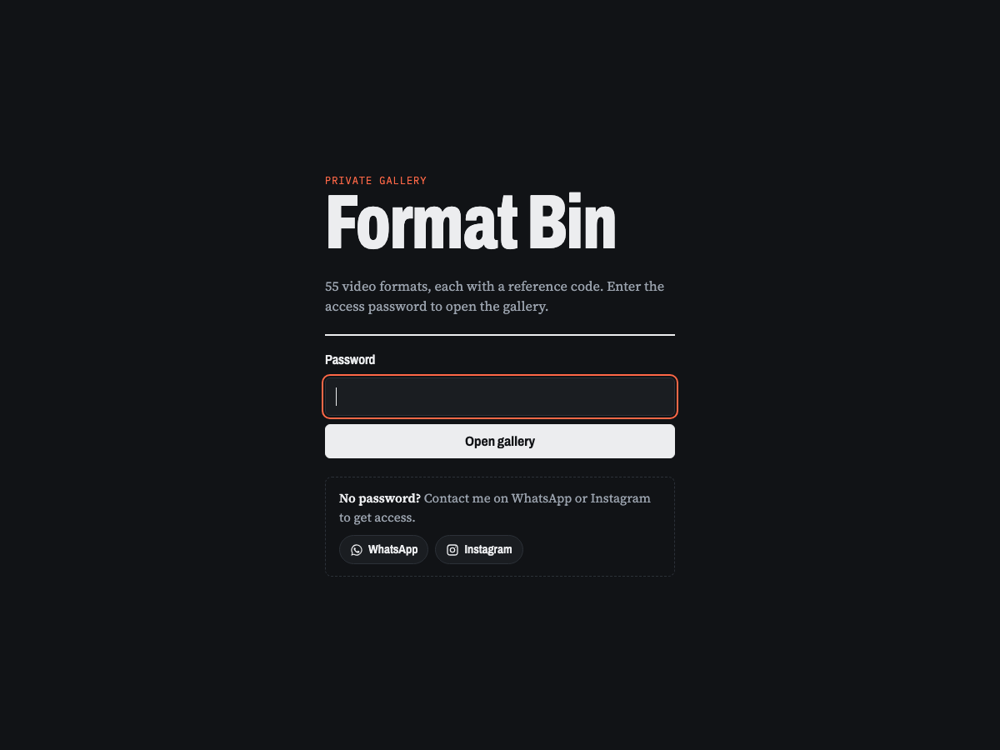

# Format Bin

A private gallery of 55 video formats, each with a reference code:

- `lemo:<slug>` — a Lemo-Opuscar style
- `ai:<skill>` — an AI_Animation skill
- `house:<name>` — a format saved from a reference reel

Live site: https://format-bin-videos.vercel.app

## Access

The gallery is password-protected. To get the password, contact me on [WhatsApp](https://wa.me/919619141433) or [Instagram](https://instagram.com/_.bhavya._015).

## How it works

- `middleware.js` runs on Vercel before every request. Visitors without a valid access cookie go to `login.html`.
- The password lives in the Vercel environment variable `ACCESS_PASSWORD`. If it is not set, nobody can sign in.
- A correct password sets an HttpOnly cookie for 30 days. Visit `/api/logout` to sign out.

## Editing the gallery

`template.html` is the source; `build_gallery.py` inlines `lemo.json` into `index.html`. Thumbnails live in `thumbs/`, source images in `raw/`.
